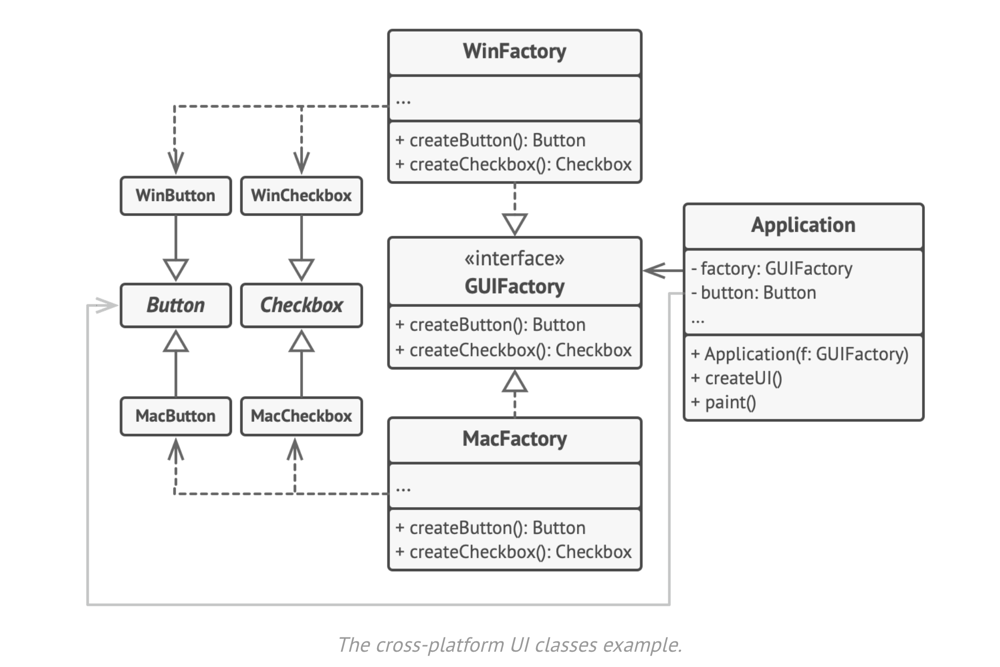

# Abstract Factory
Abstract Factory is a creational design pattern that 
lets you produce families of related objects without specifying
their concrete classes.

For eg lets create a GUIFactory that will support windows and mac


To run the example run ```composer udpate``` on abstract-factory directory.
then run ```php index.php```
